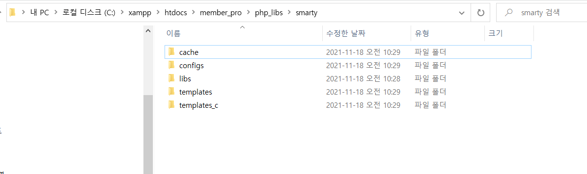

## SECTION 76 테이블 설계
<br>

### 회원테이블 
```sql
drop table if exists memberTbl; 
create table memberTbl(
	id mediumint unsigned not null auto_increment primary key, 
    username varchar(50),
    password varchar(128),
    last_name varchar(50),
    first_name varchar(50),
    birthDay char(8),
    prefecture smallint,
    reg_date datetime,
    cancel datetime
);
INSERT INTO membertbl (username, password, last_name, first_name, birthday, prefecture, reg_date, cancel) VALUES
  ('user', '$2y$10$jUaIP/qDbBFIJFEPfd/W2ewsCIzoGPrbxCaHOdWjwQFUNRGoKT4DS', '고', '길동', '20130101', '1', now(), NULL);
```

<br>

### 행정구역테이블
```sql
drop table if exists prefecture; 
create table prefecture(
	id smallint primary key, 
    prefecture varchar(10) 
); 

insert into prefecture(id,prefecture) values('1','서울특별시');
INSERT INTO prefecture (id, prefecture) VALUES (2, '부산광역시');
INSERT INTO prefecture (id, prefecture) VALUES (3, '대구광역시');
INSERT INTO prefecture (id, prefecture) VALUES (4, '울산광역시');
INSERT INTO prefecture (id, prefecture) VALUES (5, '광주광역시');
INSERT INTO prefecture (id, prefecture) VALUES (6, '대전광역시');
INSERT INTO prefecture (id, prefecture) VALUES (7, '인천광역시');
INSERT INTO prefecture (id, prefecture) VALUES (8, '세종특별자치시');
INSERT INTO prefecture (id, prefecture) VALUES (9, '경기도');
INSERT INTO prefecture (id, prefecture) VALUES (10, '강원도');
INSERT INTO prefecture (id, prefecture) VALUES (11, '충청북도');
INSERT INTO prefecture (id, prefecture) VALUES (12, '충청남도');
INSERT INTO prefecture (id, prefecture) VALUES (13, '경상북도');
INSERT INTO prefecture (id, prefecture) VALUES (14, '경상남도');
INSERT INTO prefecture (id, prefecture) VALUES (15, '전라북도');
INSERT INTO prefecture (id, prefecture) VALUES (16, '전라남도');
INSERT INTO prefecture (id, prefecture) VALUES (17, '제주특별자치도');
INSERT INTO prefecture (id, prefecture) VALUES (18, '함경북도');
INSERT INTO prefecture (id, prefecture) VALUES (19, '함경남도');
INSERT INTO prefecture (id, prefecture) VALUES (20, '평안북도');
INSERT INTO prefecture (id, prefecture) VALUES (21, '평안남도');
INSERT INTO prefecture (id, prefecture) VALUES (22, '황해도');
```

<br>

### 임시회원테이블
```sql
DROP TABLE IF EXISTS premember;
CREATE TABLE premember(
  id         MEDIUMINT UNSIGNED NOT NULL AUTO_INCREMENT primary key,
  username   VARCHAR(50),
  password   VARCHAR(128),
  last_name  VARCHAR(50),
  first_name VARCHAR(50),
  birthday   CHAR(8),
  ken        SMALLINT,
  link_pass  VARCHAR(128),
  reg_date   DATETIME
);
```

<br>

##  기본적인 프로젝트 구성 

> 프로젝트 경로 구성 
- C:\xampp\htdocs\member_pro
- C:\xampp\htdocs\member_pro\www
  + 현재 프로젝트의 DoumnetRoot가 된다. 
  + index.php : 프로젝트의 시작점이 된다. 
- C:\xampp\htdocs\member_pro\php_libs
  + 웹브라우저에서 접근할 수없도록 루트경로 하위에 둔다. 
  + 프로젝트에서 사용하는 각종 라이브러리들을 모아둔다. 
  + init.php : 
  + class 폴더 : 컨트롤러객체, 모델객체
  + smarty 폴더 : 뷰객체 

<br>

> httpd.conf 파일 경로 
``` xml
DocumentRoot "C:/xampp/htdocs/member_pro/www
<Directory "C:/xampp/htdocs/member_pro/www">
    Options Indexes FollowSymLinks Includes ExecCGI
    AllowOverride All    
    Require all granted
</Directory>
```

<br>

>php_libs/init.php
```php
## 초기화 파일입니다.

# 테스트 문자열
define("_TEST", "TEST 성공!"); 

# 경로상수 
# _ROOT_DIR : index.php에서 정의한다. 
define('_PHP_LIBS_DIR', _ROOT_DIR."../php_libs/"); 
```

<br>

> www/index.php 
```php
# 설정파일의 상수명에는 '_'를 붙여 이 시스템에서 정의한 상수라는 것을 알 수 있도록 한다. 
# __DIR___ : 현재 프로젝트의 루트경로이다. PHP에서 정의한 상수이다. 
# C:/xampp/htdocs/member_pro/www
define('_ROOT_DIR', __DIR__.'/' ); 

# 루트경로 하위폴더인 phplibs에서 init.php를 불러온다. 
require_once _ROOT_DIR.'../php_libs/init.php';

# 임포트 되었는지 확인하자. 
echo _TEST, "<br>"; 
echo _PHP_LIBS_DIR, "<br>";
<br>
```

## Smarty 템플릿 

- 다음의 링크에서 smarty를 다운로드 한다. 
  + https://github.com/smarty-php/smarty/releases/tag/v3.1.39
- 압축을 풀고 libs폴더를 php_libs/smarty폴더에 복사한다.
- php_libs/smarty 하위폴더로 cache, configs, templates, templates_c 폴더를 추가한다.


<br>

- Smarty 라이브러리 관련 상수를 init.php에 정의하자.
- Smarty.class.php를 임포트한다. 
> init.php
```php 
define("_SMARTY_LIBS_DIR",_PHP_LIBS_DIR."smarty/libs/");
define("_SMARTY_TEMPLATES_DIR",_PHP_LIBS_DIR."smarty/templates/");
define("_SMARTY_TEMPLATES_C_DIR",_PHP_LIBS_DIR."smarty/templates_c/");
define("_SMARTY_CONFIG_DIR",_PHP_LIBS_DIR."smarty/configs/");
define("_SMARTY_CACHE_DIR",_PHP_LIBS_DIR."smarty/cache/");

# 필요한 설정파일 읽기
require_once(_SMARTY_LIBS_DIR."Smarty.class.php"); 
```

<br>

- 헤더 본문 등 템플릿 파일을 제작한다. 
- php_libs/template 폴더에 파일을 생성한다. 
> header.tpl
```tpl
<!DOCTYPE html>
<html lang="ko">
<head>
    <meta charset="UTF-8">
    <meta http-equiv="X-UA-Compatible" content="IE=edge">
    <meta name="viewport" content="width=device-width, initial-scale=1.0">
    <title>이게되네</title>
</head>
<body>
  <nav>
      <h1>여기는 네이비게이션</h1>
  </nav>
```

<br>

- header.tpl, footer.tpl common폴더 안에 둔다. 
- php_libs/smarty/templates/common/header.tpl
- php_libs/smarty/templates/common/footer.tpl

> footer.tpl
```tpl
<footer>
    <h1>여기는 푸터</h1>
</footer>
</body>
</html>
```

<br>

> contents.tpl
```php
<div>  
    <h1>{$easy}</h1>
    <h2>스마티 테스트</h2>
    <h3>Easy</h3>
</div>
```

<br>

- smarty 객체를 생성하고 경로 변수에 상수값을 할당하자. 
> index.php
```php
# Smarty 객체를 생성하고 상수 경로를 할당 
$smarty = new Smarty; 
$smarty->template_dir = _SMARTY_TEMPLATES_DIR; 
$smarty->compile_dir = _SMARTY_TEMPLATES_C_DIR; 
$smarty->config_dir = _SMARTY_CONFIG_DIR; 
$smarty->cache_dir = _SMARTY_CACHE_DIR; 

# 모델객체 : 뷰페이지에서 사용할 데이터를 할당한다. 
$smarty->assign('easy',"light weight baby!! easy~!");

# 파일경로 지정 
# php_libs/template이 루트경로이다. 
$header = 'common/header.tpl';
$footer = 'common/footer.tpl';
$file = "contents.tpl"; 

# html 페이지를 렌더링 한다. 
$smarty->display($header); 
$smarty->display($file); 
$smarty->display($footer); 
```
<br>

## 컨트롤러
- php_libs 아래에 class폴더 생성

> php_libs/class/BaseController.php
```php
class BaseController {

  # [1]
  protected $next_type;
  protected $next_action;
  protected $is_system = false; // 관리자 기능 여부 
  protected $view; // 스마티 라이브러리
  protected $title; // 페이지 제목 
  protected $file; // 컨텐츠 내용

  # [5]
  public function __construct($flag = false){
      $this->set_system($flag);
      $this->view_initialize();
  }

  # [2]
  public function set_system($flag){
  $this->is_system = $flag;
  }

  # [3]
  private function view_initialize(){
      $this->view = new Smarty;
      ## 경로설정 
      $this->view->template_dir = _SMARTY_TEMPLATES_DIR;
      $this->view->compile_dir = _SMARTY_TEMPLATES_C_DIR;
      $this->view->config_dir = _SMARTY_CONFIG_DIR;
      $this->view->cache_dir = _SMARTY_CACHE_DIR;

      ## 공통변수 
      $this->view->assign('is_system',$this->is_system);
      $this->view->assign('SCRIPT_NAME',_SCRIPT_NAME);
  }


  # [4] html 렌더링 
  protected function view_display(){
      $header = "common/header.tpl";
      $footer = "common/footer.tpl";
      $this->view->display($header);
      $this->view->display($this->file);
      $this->view->display($footer);
  }
}
```

<br>

> php_libs/class/MemberController.php
```php
class MemberController  extends BaseController{
    public function run(){
        $this->file = "contents.tpl";
        $this->view_display();
    }
}
```

<br>

> init.php
```php
# 경로상수 
define("_PHP_LIBS_DIR", _ROOT_DIR."../php_libs/");
define("_PHP_LIBS_CLASS", _PHP_LIBS_DIR."class/"); // 클래스 경로 상수 [1]
define("_SCRIPT_NAME",$_SERVER['SCRIPT_NAME']); // 환경변수 [2]

# Smarty 경로상수
define("_SMARTY_LIBS_DIR",_PHP_LIBS_DIR."smarty/libs/");
define("_SMARTY_TEMPLATES_DIR",_PHP_LIBS_DIR."smarty/templates/");
define("_SMARTY_TEMPLATES_C_DIR",_PHP_LIBS_DIR."smarty/templates_c/");
define("_SMARTY_CONFIG_DIR",_PHP_LIBS_DIR."smarty/configs/");
define("_SMARTY_CACHE_DIR",_PHP_LIBS_DIR."smarty/cache/");

require_once _SMARTY_LIBS_DIR."Smarty.class.php"; 

# 클래스파일 로딩
require_once _PHP_LIBS_CLASS."BaseController.php"; # [3]
require_once _PHP_LIBS_CLASS."MemberController.php"; # [4]
```

<br>

> contents.tpl
```tpl
<div>
    <h1>본문영역</h1>
    <h2>이지</h2>
    <h3>$_SERVER['SCRIPT_NAME'] : {$SCRIPT_NAME}</h4>
</div>
```

<br>

> index.php
```php
define('_ROOT_DIR', __DIR__.'/');
require_once _ROOT_DIR."../php_libs/init.php";

$memberController = new MemberController; 
$memberController->run();
```

