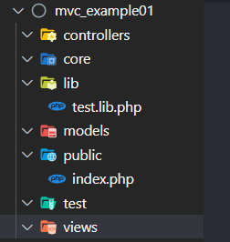

## httpd.conf 설정 
```
DocumentRoot "C:/xampp/htdocs/mvc_example01/public"
<Directory "C:/xampp/htdocs/mvc_example01/public">
    Options Indexes FollowSymLinks Includes ExecCGI
    AllowOverride All    
    Require all granted
    RewriteEngine On
    RewriteRule ^([^.]*)/?$ index.php?param=$1 [L]
</Directory>
```

<br>


## 기본 구조 생성


<br>

> test.lib.php
```php
function dumping($test)
{
    echo "<pre>";
    var_dump($test);
    echo "</pre>";
    exit;
}
```

<br>

> index.php
```php
include dirname(__DIR__).'/lib/test.lib.php';

# 확인 후 삭제
$test = "dumping함수가 잘 동작하는 지 확인";
dumping($test);
```

<br>

## 컴포저 시작 및 오토로딩 설정
- git bash에서 다음 명령 실행
- 실행하는 위치는 mvc_example01(최상위 폴더)이다.
```
 composer init
```
- 모든 내용은 따로 설정할 필요가 없다 모두 Enter로 넘긴다.

<br>

> composer.json
```js
// ...생략
    "autoload": {
        "psr-4": {
            "app\\": "./"
        }
    },
# ...
```
- 수정 후 git bash에서 다음을 실행한다.
```
composer update
```

<br>

## index.php
```php 
include dirname(__DIR__).'/lib/test.lib.php';
include dirname(__DIR__).'/vendor/autoload.php'; // 추가
```

<br>

## 애플리케이션 객체와 라우터 객체 
- core폴더 아래 Application.php 파일 생성 후 클래스 정의
- core폴더 아래 Router.php 파일 생성 후 클래스 정의 

<br>

> index.php
- Application 객체를 생성하여 run()메소드 실행 
```php
use app\core\Application;

/* ... */

$app = new Application(); 
$app-> run();
```

- 주의! : 반드시 네임스페이스를 선언한다. 
- 생성자에서 라우터 객체를 생성하고 
- run()메서드에서는 라우터의 resolove를 호출한다.

> Application.php
```php
namespace app\core; 

class Application
{
    public static Application $app;
    public Router $router; 

    public function __construct()
    {
        echo "Application 객체 생성 <br>"; // 확인 후 삭제 
        self::$app = $this; 
        $this->router = new Router(); 
    }

    public function run() 
    {
        echo $this->router->resolve(); 
    }
}
```

- resolove메서드 정의 
> Router.php 
```php
namespace app\core; 

class Router 
{
    public function resolve()
    {
        return "resolve 메서드 실행";
    }
}
```
- 브라우저에서 localhost로 요청하여 작동하는지 테스트한다. 

<br>

## 컨틀롤러 생성 및 라우터에 요청정보 저장 
- 요청정보에 따른 콜백함수를 정의할 컨트롤러 생성 
    + controllers 폴더 아래 Controller 생성
    + controllers 폴더 아래 SiteController 생성 
    + Application 객체에 controller를 멤버변수로 선언한다.
- 라우터에 요청정보를 저장할 get()메서드 및 post()메서드 정의 
- index.php에서 요청정보 설정 
- 애플리케이션을 실행했을 때 라우터의 rosolve가 콜백함수를 호출

> Controller.php 
```php
namespace app\controllers; 

class Controller 
{
    
}
```

> SiteController.php
```php
namespace app\controllers; 

class SiteController extends Controller
{
    public function home() 
    {
        return "Hello World";
    }
}
```

> Application.php
```php
public Controller $controller; 
```

<br>

>Router.php
```php
protected array $routes = []; 

public function get($path, $callback)
{
    $this->routes['get'][$path] = $callback; 
} 

public function post($path, $callback)
{
    $this->routes['get'][$path] = $callback; 
} 
```

>index.php 
```php
// ... 생략
$app = new Application(); 
$app->router->get('/', [SiteController::class, 'home']); 
$app-> run();
```

>Router.php
```php
public function resolve()
{
    $path = $_SERVER['REQUEST_URI']; 
    $method = strtolower($_SERVER['REQUEST_METHOD']);
    $callback = $this->routes[$method][$path] ?? false; 

    if($callback === false)
    {
        return "잘 못된 요청입니다.";
    }

    if(is_array($callback)){
        Application::$app->controller = new $callback[0];
        $callback[0] = Application::$app->controller; 
    }
    return call_user_func($callback);
}
```

## Request 객체 분리 
- Request 객체의 역할 
    + 클라이언트가 요청한 URI 리턴
    + 클라이언트가 요청한 METHOD 리턴
    + 클라이언트의 REQUEST METHOD get인지 post인지 판단
- core폴더 아래 Request.php 파일 생성 및 클래스 정의 
- Application 클래스에서 멤버변수 선언 및 생성 의존관계 설정

<br>

```php
namespace app\core;
class Request 
{
    public function getPath()
    {
    
    }

    public function method()
    {
    
    }

    public function isGet()
    {

    }

    public function isPost()
    {

    }
}
```  

<br>

>Application.php
```php
class Application
{
    public static Application $app;
    public Router $router;
    public Controller $controller;  
    public Request $request; // 멤버변수 선언


    public function __construct()
    {
        self::$app = $this;
        $this->request = new Request(); // 객체생성
        $this->router = new Router($this->request); // DI
    }
/* ... */
```

> Reuest 클래스의 메서드 구현
```php
public function getPath()
{
    $path = $_SERVER['REQUEST_URI'];  
    $position = strpos($path,'?'); 
    if($position === false){
        return $path; 
    }
    return substr($path, 0 , $position);
}

public function method()
{
    return strtolower($_SERVER['REQUEST_METHOD']);
}

public function isGet()
{
    return $this->method() === 'get'; 
}

public function isPost()
{
    return $this->method() === 'post'; 
}
```

> 라우터에서 Request 객체 사용 
```php
class Router 
{
    protected array $routes = []; 
    public Request $request; // 멤버변수 선언

    public function __construct($request)
    {
        $this->request = $request; // 생성자 주입
    }

/* ... */

    public function resolve()
    {
        $path = $this->request->getPath();  // Request 객체 사용
        $method = $this->request->method(); // Request 객체 사용
        $callback = $this->routes[$method][$path] ?? false; 

/* ... */
    }
```

## View 페이지 
- 컨트롤러는 라우터에 페이지렌더링을 요청한다. 
    + 라우터 객체를 컨트롤러 멤버객체로 선언하고 생성자로 주입한다.
- views 폴더 아래 home.php 파일 생성.
- 라우터에 페이지렌더링 메서드를 구현한다. 

> Controler.php 
```php
class Controller 
{
    public Router $router; 

    public function __construct()
    {
        $this->router = Application::$app->router; 
    }
}
```

<br>

> SiteControler.php
```php
class SiteController extends Controller
{
    public function home() 
    {
        return $this->router->renderView('home'); 
    }
}
```

<br>

> home.php
```html
<h1>Hello World</h1>
```

<br>

- 프로젝트의 루트 경로를 Application 클래스의 멤버변수로 선언한다.
- index.php에 프로젝트 루트 경로를 주입한다. 
> Application.php
```php
class Application
{
    /* ... */    
    public static $ROOT_DIR; 
    /* ... */    
    public function __construct($ROOT_DIR)
    {
        self::$ROOT_DIR = $ROOT_DIR;
        /* ... */    
    }
    /* ... */    
```

<br>

>index.php
```php
/* ... */
$app = new Application(dirname(__DIR__)); 
```

<br>

> Router.php
```php
public function renderView($view)
{
    include Application::$ROOT_DIR."/views/{$view}.php";
}
```

## 레이아웃 추가 
- views/layouts 폴더 아래 main.php 파일 생성 
- Router 객체에서 viewRender메서드 수정 
    + 레이아웃을 렌더링하는 메서드 생성
    + 컨텐츠만 렌더링하는 메서드 생성 

<br>

> main.php
```html
<ul>
    <li><a href="/">HOME</a></li>
    <li><a href="/contact">CONTACT US</a></li>
</ul>
<div>
    {{contents}}
</div>
<footer>
    <h1>footer</h1>
</footer>
```

<br>

> Router
```php
# 레아아웃과 뷰컨텐츠 조립 
public function renderView($view)
{
    $layouts = $this->renderLayout(); 
    $viewContetns = $this->renderViewContents($view);
    return str_replace('{{contents}}',$viewContetns,$layouts);
}

# 레이아웃 렌더링
public function renderLayout()
{
    ob_start();
    include Application::$ROOT_DIR. "/views/layouts/main.php";
    return ob_get_clean(); 
}

# 뷰 컨텐츠 렌더링
public function renderViewContents($view)
{
    ob_start();
    include Application::$ROOT_DIR. "/views/{$view}.php";
    return ob_get_clean(); 
}
```

<br>

## 뷰페이지 추가
- views폴더 아래 contact.php 파일 생성 
- index.php 요청정보 설정 
- SiteController에 콜백함수 생성 

<br>

> contact.php
```html
<h1>Contact</h1>
```

<br>

> index.php
```php
$app->router->get('/contact', [SiteController::class, 'contact']); 
```

<br>

> SiteController
```php
public function contact() 
{
    return $this->router->renderView('contact'); 
}
```

<br>

## 에러 페이지 표시 
- views _404.php 파일생성
- 라우터에서 콜백함수를 못 찾은 경우 페이지 렌더링 처리 
- 헤더에서 404 응답처리 
    + core 폴더 아래 Response.php 파일 및 클래스 생성 
    + Application 객체에어서 의존관계 설정
    + Router객체에서 주입을 받기 위한 생성자 수정 
    + Router객체의 resolve 메서드에서Response 객체에게 404 응답코드 전달

<br>

> _404.php
```html
<h1>잘못된 요청입니다.</h1>
```

<br>

> Router.php -> resolve()
```php
if($callback === false)
{
    return $this->renderView('_404');
}
```

<br>

> Response.php 
```php
namespace app\core;

class Response
{
    public function setStatusCode(int $code)
    {
        http_response_code($code); 
    }
}
```

<br>

> Application.php
```php
public Response $response; // 멤버변수 선언

/* 생성자 메서드 */
$this->response = new Response(); // 객체 생성
$this->router = new Router($this->request, $this->response); // DI
```

<br>

> Router.php
```php
/* 생성자 메서드 */
public function __construct(Request $request,Response $response)
{
    $this->request = $request; 
    $this->response = $response;
}

/* resolve 메서드 */
if($callback === false)
{
    $this->response->setStatusCode(404);
    return $this->renderView('_404');
}
```

## 뷰페이지에 파라미터 전달
- 클라언트의 요청정보에 파라미터가 포함될 수 있다. 
- 클라이언트가 전달한 파라미터가 컨트롤러에 도달했다고 가정하자. 
- 이 때 컨트롤러는 이 파라미터를 뷰페이지에 함께 전달한다. 
> SiteController
```php
public function home() 
{
    $params = ['name' => 'leekwanghyup', 'gender'=>'male']; // 클라이언트가 전달한 파라미터 정보
    return $this->router->renderView('home', $params); 
}
```

<br>

> home.php
```php
<h1>Hello <?php echo $name ?></h1> 
<p><?php echo $test ?></p>
```

> Router.php
```php
public function renderView($view,$params=[]){  // $params=[]
    $layout = $this->renderLayout();
    $viewContents = $this->renderViewContents($view,$params); // $params
    return str_replace('{{contents}}', $viewContents, $layout);
}
/* ... */
```

<br>

```php
public function renderViewContents($view, $params=[]) // $params=[]    
{ 
    $test = '인클루드가 일어나는 경우 함수 내에서 선언된 변수를 뷰페이지에서 사용할 수 있다.';
    foreach ($params as $key => $value) { 
        $$key = $value; // $params=['name'=>'leekwanghyup' ] 인 경우 $name = 'leewkanghyup'으로 사용할 수 있다. 
    }
    ob_start();
    include Application::$ROOT_DIR."/views/{$view}.php"; // 인클루드가 일어나는 경우 위의 변수들을 뷰페이지에서 사용할 수 있다. 
    return ob_get_clean();
}
```

<br>

## Controller 리팩토링
- 컨트롤러의 모든 메서드는 라우터의 renderView메서드를 사용하고 있다. 

> Controller.php
```php
public function render($view, $params=[])
{
    return $this->router->renderView($view, $params);
}
```

> SiteController 
```php
public function home() 
{
    $params = ['name' => 'leekwanghyup', 'gender'=>'male']; //
    return $this->render('home',$params);
}

public function contact() 
{
    return $this->render('contact');
}
```

<br>

## POST방식 데이터 처리 

> contact.php POST 폼태그 작성
```html
<h1>Contact Us</h1>
<form action="/contact" method="post">
    <table>
        <tr>
            <td>Subject</td>
            <td><input type="text" name="subject" ></td>
        </tr>
        <tr>
            <td>Email</td>
            <td><input type="text" name="email" ></td>
        </tr>
        <tr>
            <td>Body</td>
            <td><textarea name="body" cols="30" rows="10"></textarea></td>
        </tr>
        <tr>
            <td><button>Submit</button></td>
        </tr>
    </table>
</form>

```
> index.php 라우터에 요청정보 등록
```php
$app->router->post('/contact',[SiteController::class, 'handleContact']);
```

> SitdeController 콜백함수 등록
```php
public function handleContact()
{
    dumping($_POST);
    return "data handling"; 
}
```
- 입력폼에 값을 채워넣고 전송하여 테스트한다. 

<br><br>

## Request객체에서 파라미터 필터링
- 클라이언트에서 전달한 파라미터는 Request 객체에 저장해야한다.
    + Request 클래스에 getBody() 함수 정의 
    + 입력 받은 값이 올바르게 처리될 수 있도록 필터링을 해야한다.

> Request.php
```php
public function getBody()
{
    $body = [];
    if($this->isPost()){
        foreach ($_POST as $key => $value ){
            $body[$key] = filter_input(INPUT_POST, $key,FILTER_SANITIZE_SPECIAL_CHARS);
        }
    }
    if($this->isGet()){
        foreach ($_GET as $key => $value ){
            $body[$key] = filter_input(INPUT_GET, $key,FILTER_SANITIZE_SPECIAL_CHARS);
        }
    }
    return $body; 
}
```

<br>

>SiteController
```php
public function handleContact()
{
    # getBody() 메서드를 호출하여 올바른 값이 들어오는지 확인하자.
    $body = Application::$app->request->getBody(); 
    dumping($body);
    return "data handling"; 
}
```

<br><br>

## 콜백함수로 전달

>SiteController
```php
public function handleContact(Request $request)
{
    $body = $request->getBody(); // 테스트 후 삭제
    dumping($body); // 테스트 후 삭제 
    return "data handling"; 
}
```

<br>

```php
public function resolve()
{
    /* ...  */
    
    # 콜백을 호출할 때 파라미터로 request 객체를 전달해야 한다. 
    return call_user_func($callback, $this->request);
}
```

<br><br>

## 회원가입 페이지 및 로그인 페이지  
- AuthController 컨트롤러 생성
    + login() 
    + register() 
- index.php에서 라우터 정보 설정
- 뷰페이지 제작
    + register.php
    + login.php
- main.php : 네비게이셔 수정

<br>

> AuthController.php
```php
namespace app\controllers;
use app\core\Request;

class AuthController extends Controller
{
    public function login(Request $reqeust)
    {
        if($reqeust->isPost()){
            return 'handle submitted data';
        }
        return $this->render('login');
    }

    public function register(Request $reqeust)
    {
        if($reqeust->isPost()){
            return 'handle submitted data';
        }
        return $this->render('register');
    }
}
```

<br>

> index.php
```php
$app->router->get('/login', [AuthController::class,'login'] );
$app->router->post('/login', [AuthController::class, 'login'] );
$app->router->get('/register', [AuthController::class, 'register'] ); 
$app->router->post('/register', [AuthController::class, 'register'] ); 
```

<br>

> login.php
```php
<h1>Login</h1>
``` 

<br>

> register.php
```html
<h1>Register</h1>
<form action="/register" method="post">
    <table>
        <tr>
            <td>First Nmae</td>
            <td><input type="text" name="firstname"></td>
        </tr>
        <tr>
            <td>Last tNmae</td>
            <td><input type="text" name="lastname"></td>
        </tr>
        <tr>
            <td>Email</td>
            <td><input type="text" name="email"></td>
        </tr>
        <tr>
            <td>password</td>
            <td><input type="password" name="password"></td>
        </tr>
        <tr>
            <td>Confirm Password</td>
            <td><input type="password" name="confirmPassword"></td>
        </tr>
        <tr>
            <td><button>Submit</button></td>
        </tr>
    </table>
</form>
```

<br>

> main.php
```html 
<ul>
    <li><a href="/">HOME</a></li>
    <li><a href="/contact">CONTACT US</a></li>
    <li><a href="/login">Login</a></li>
    <li><a href="/register">Register</a></li>
</ul>

```

<br><br>

## 여러개의 레이아웃 사용 
- views/layouts 폴더 아래 auth.php 파일 생성 
- 어떤 레이아웃을 사용할 지 여부는 컨트롤러가 결정한다. 
- 콜백마다 사용할 레이아웃을 설정한다.
- 라우터에 레이아웃을 렌더링하는 메서드를 수정한다. 

> auth.php
```html
<h1>여러개의 레이아웃 사용하기</h1>
<ul>
    <li><a href="/">HOME</a></li>
    <li><a href="/contact">CONTACT US</a></li>
    <li><a href="/login">Login</a></li>
    <li><a href="/register">Register</a></li>
</ul>
<div>
    {{contents}}
</div>
```

<br>

> Controller.php
```php
class Controller
{
    public Router $router; 
    public string $layout = 'main'; // 기본 레이아웃을 main.php로 설정

    /* ... */
    public function setLayout($layout)
    {
        $this->layout = $layout; 
    }
}
```

> AuthController.php
```php
public function login(Request $reqeust)
{
    /*  ...  */
    $this->setLayout('auth');
    return $this->render('login');
}

public function register(Request $reqeust)
{
    /*  ...  */
    $this->setLayout('auth');
    return $this->render('register');
}
```

> Router.php
```php
public function renderLayout(){
    $layout = Application::$app->controller->layout; 
    ob_start();
    include Application::$ROOT_DIR."/views/layouts/{$layout}.php";
    return ob_get_clean();
}
```


